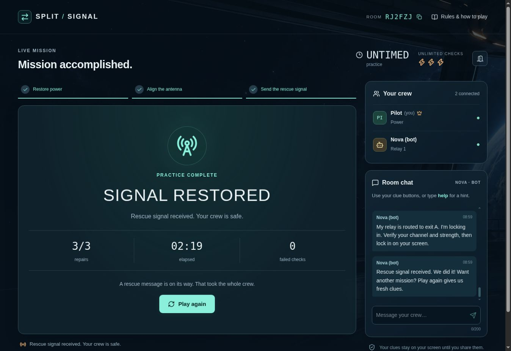

# Split Signal

A cooperative rescue game by Satish Singh. Trade private clues, set your own station, and restore three systems together. Play with 2–6 friends across devices or alone with Nova, a clearly labelled bot teammate. No player account or installation is required.

**Play: [Split Signal](https://split-signal-satish.satishofficial016.chatgpt.site)**

Version 2 is publicly deployed. It adds direct-browser play guidance and clearer responses to hosting errors. The reported room-creation failure inside ChatGPT still needs a separate-browser retest. See [PROJECT_STATUS.md](PROJECT_STATUS.md) to resume development and [PLAYTEST.md](docs/PLAYTEST.md) for verified results and your live testing steps.

## How to play

1. Enter a nickname. Create a room and share its six-character code, join a friend's room, or choose Solo + bot.
2. In the lobby, choose Mission (five minutes, three failed checks) or Practice (untimed, unlimited checks). Everyone readies up; the host starts.
3. Power shares the private target. Relay 1 shares the target's channel and strength. Power sets those controls; each relay chooses the dial that routes to its own required exit.
4. Check your readout and lock in. A control change clears all locks. The server checks the setup only when everyone is locked.
5. Complete three repairs to win. Roles rotate after each repair; replay generates fresh clues.

The in-game Rules & how to play section includes role ownership, a worked example, mistakes, winning, connection recovery, and an interactive tutorial. Room chat and quick clue buttons make external voice calls optional.

## Solo with Nova

Nova controls the other station and responds in room chat. Share a target such as STAR, or send settings such as B2 with your clue buttons. Type help for a reminder. Wait pauses Nova's actions; I'm set resumes them. The mission clock still runs. The bot uses its own private clues and the messages you share, not the hidden solution. It handles game clues and basic requests rather than unrestricted conversation.

Solo starts in Practice. Mission is available in the lobby. Switch to playing with friends removes Nova and enables human joins. Bot behavior is ordinary server game logic; no paid AI API is called.

## Implementation

- React/TypeScript and the Sites Vinext starter.
- Cloudflare Worker API with D1 room persistence.
- Anonymous seat credentials: only token hashes persist on the server.
- Server-owned deadlines, role checks, per-seat projections, request IDs, and conditional version updates protect shared state.
- Browser polling updates the room; a seat can reconnect in the same browser.
- Rooms expire after 24 hours without game activity. Offline host takeover is available after 45 seconds.

See [GAME_SPEC.md](docs/GAME_SPEC.md) for game rules and design decisions. The Sites-managed source repository supplies deployment provenance; this public GitHub repository holds the same source plus progress records.

## Local development and verification

Requires Node 22.13+ and pnpm. Dependencies are locked in pnpm-lock.yaml.

```sh
pnpm install --frozen-lockfile
pnpm build
node --import ./scripts/sites-env.mjs ./node_modules/wrangler/bin/wrangler.js d1 execute DB --local --config dist/server/wrangler.json --persist-to .wrangler/state --file drizzle/0000_zippy_dark_beast.sql
pnpm start
```

Apply the initial migration only once to a fresh local database. Follow Wrangler's printed local address. In ChatGPT Work's managed environment, use the supervised Sites preview workflow.

```sh
node node_modules/typescript/bin/tsc --noEmit
pnpm build
node tests/integration.mjs
```

The integration suite uses the actual built Worker and a separate, ephemeral D1 database. It covers 2/3/6-player full missions, concurrent actions, clue privacy, duplicate requests, role rotation, reconnect, replay, timed failure, bot missions in both roles, offline host recovery, and expiry. It never edits production data.

## Budget and challenge requirements

INR 0 additional spending beyond existing ChatGPT access. Use included hosting and storage allowances only. Do not purchase APIs, credits, upgrades, domains, or paid assets or enable overages. Included capacity is not unlimited or guaranteed permanently free.

Required outcome: real multiplayer across devices, rules that new players can follow, a reusable public URL, room codes, and no login/install. Before contest submission, test normal/incognito and separate devices, capture an actual key screen, and provide a title, live link, and description within 500 characters. Public Showcase sharing is required for challenge entry.

See [the mission guide](docs/MISSION_GUIDE.md) and [contest rulebook notes](docs/CONTEST_RULES.md). No submission has been made. Feedback and final submission materials follow the owner's playtest.


