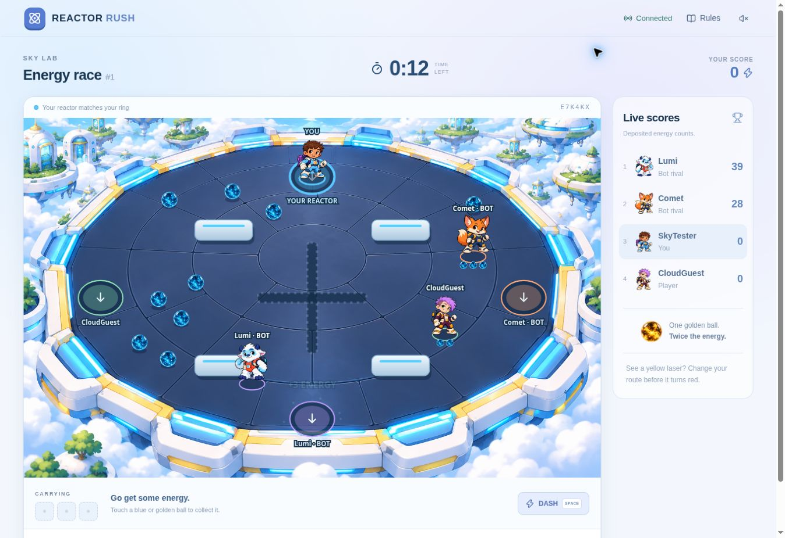

# Reactor Rush · Sky Lab

A multiplayer energy race by Satish Singh. Choose a character, collect glowing energy, dodge warning lasers and return to your reactor to score. Play with friends across devices or race clearly labelled bot rivals. No player account or installation is required.

**Game URL:** https://split-signal-satish.satishofficial016.chatgpt.site

**Reactor Rush version 3 is live.** Publication succeeded on October 3, 2026. See [PROJECT_STATUS.md](PROJECT_STATUS.md) for the exact release and recovery information. Final checks passed: TypeScript, production build, 36 engine checks and 74 Worker/API assertions plus HTTP validation. Signed-out production and physical-device play still need the owner’s check.



## How to play

1. Enter a nickname and choose Iris, Orbit, Juno, Comet, Lumi or Jet. All characters have the same abilities.
2. Create a room and share its six-character code, join a friend's room, or select Solo + bots. A room supports 2–6 participants including bots.
3. The host chooses 60 seconds, 90 seconds, or a custom 30–600 seconds. Everyone readies up; the host starts the shared countdown.
4. Move with WASD/arrow keys or the touch joystick. Hold a direction and press Space/tap Dash for a speed burst every three seconds.
5. Touch energy to collect it. Carry at most three balls, including at most one golden ball. Blue is worth 1 point; golden is worth 2.
6. Return to your own labelled reactor to **deposit energy**. Two blue balls and one golden ball score 4 points. Carrying alone earns nothing.
7. Yellow lasers warn before turning red. Crossing an active laser drops one ball. Gold appears at a shared random reachable location and expires after 15 seconds on the ground.
8. Most deposited energy when time ends wins. Ties share victory. The host can choose Play again to reuse the room.

Rules are visible on the front page and available during play. Refresh the same browser tab to recover your seat. A connected player takes over if the host is offline for 15 seconds. Hosts can remove lobby players offline for 15 seconds so an abandoned seat cannot block a new round.

## Implementation

- React 19, TypeScript, canvas rendering and responsive Sky Lab styling.
- Cloudflare-compatible Worker API with the existing Sites D1 database.
- Server-owned simulation, deadlines, random spawns, bot decisions and scoring. Browsers send bounded input, never scores or positions.
- Independent per-tab seat credentials; only token hashes persist in D1. Versioned conditional writes and request IDs protect concurrent actions.
- Sequential HTTP room updates with client animation prediction and correction. Keyboard, pointer joystick, optional sound and reduced-motion support.
- Ordinary-code bots, no LLM/API usage charge. Rooms expire after 24 hours without activity.

[Current specification](docs/REACTOR_RUSH_SPEC.md) · [Design decisions](docs/REACTOR_RUSH_DESIGN.md) · [Test evidence](docs/PLAYTEST.md)

The public GitHub repository preserves code, artwork and recovery notes. Sites uses a separate managed source repository for deployment provenance. Keep both in sync after meaningful changes. Legacy Split Signal source and history are preserved; the root route now renders Reactor Rush.

## Local development

Requires Node 22.13+ and pnpm. Preserve the dependency lockfile.

```sh
pnpm install --frozen-lockfile
pnpm build
node --import ./scripts/sites-env.mjs ./node_modules/wrangler/bin/wrangler.js d1 execute DB --local --config dist/server/wrangler.json --persist-to .wrangler/state --file drizzle/0000_zippy_dark_beast.sql
pnpm start
```

Apply the initial migration only once to a fresh local database. Never reapply it to an existing database. Follow Wrangler's printed address. ChatGPT Work uses the supervised Sites preview workflow.

```sh
node node_modules/typescript/bin/tsc --noEmit
node tests/reactor-rules.mjs
pnpm build
node tests/reactor-integration.mjs
```

The integration suite runs the actual built Worker and an ephemeral D1 database. It covers independent 2/3/6-player sessions, concurrent inputs, authorization, scoring, duplicate actions, shared deadlines, refresh, replay, bots, offline host recovery and expiry. It never modifies production data.

## Budget and challenge

INR 0 additional spending beyond existing ChatGPT access. No paid service, billed AI API, custom domain, upgrade or overage is configured. Existing included hosting/storage allowances have limits.

Mission requirements: at least two players on separate devices, clear rules, and a reusable public game URL. Before submission, complete a signed-out normal/incognito and second-device playtest. Prepare the game title, live URL, an actual screenshot and a description within 500 characters. See [mission guide](docs/MISSION_GUIDE.md) and [rulebook notes](docs/CONTEST_RULES.md). No contest entry has been submitted.
