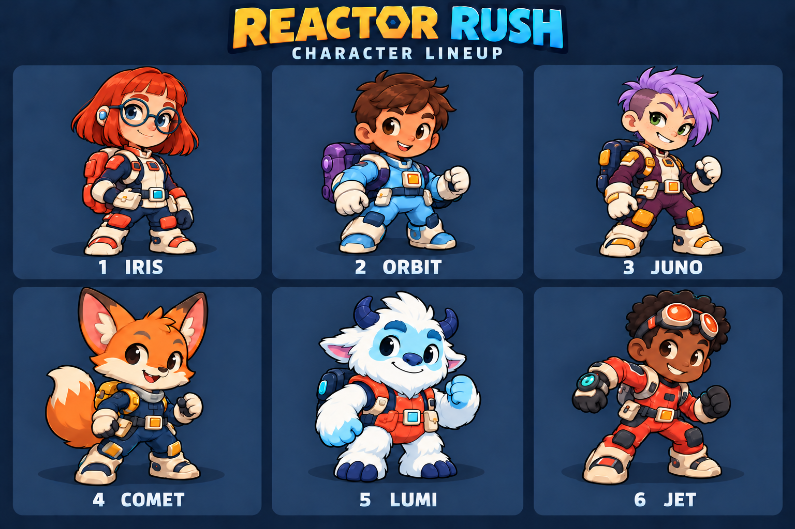
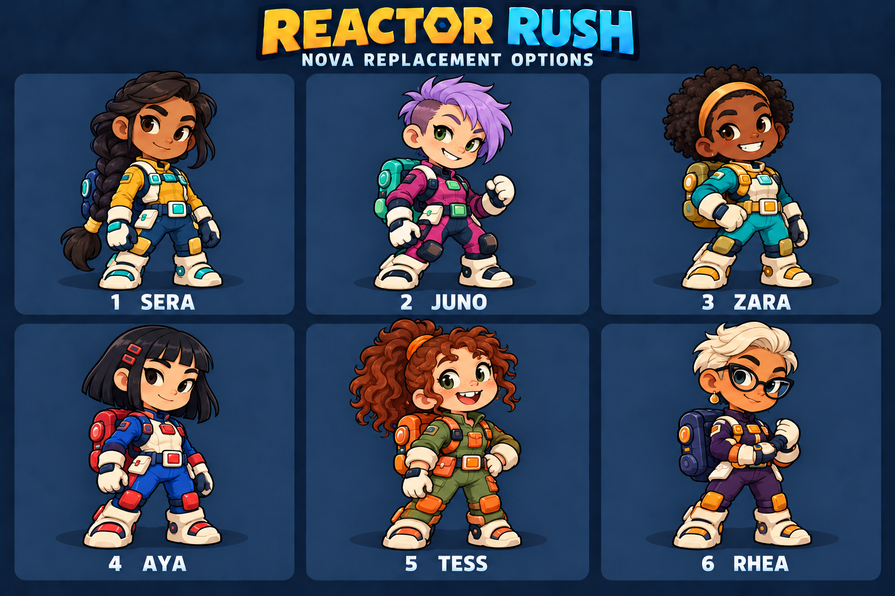

# Reactor Rush: design checkpoint

Recorded September 30, 2026, through the owner's 23:47 IST request for energy visibly spreading outward from a central core and the resulting third concept board.

## Current stage

The owner found Split Signal too focused on clues and typing and requested discussion before more building. They selected Reactor Rush as the new direction. We are still discussing the design; no Reactor Rush gameplay has been implemented or published. The current public game remains Split Signal version 2.

The owner selected Iris and Lumi, asked to remove Orbit's helmet, and then selected Juno (option 2) from six unique girl candidates to replace Nova. They subsequently supplied a colour reference and requested only Juno's outfit colours change. The current six-character roster is Iris, Orbit, Juno, Comet, Lumi and Jet. Keep these decisions when resuming. Do not restart character selection or implement the redesign without the owner's go-ahead.

**CHARACTER LINEUP LOCKED:** The owner explicitly said "Lock these 6 characters" at 18:44 IST on September 30. Names, faces, hairstyles, clothing designs and the latest colours in the current lineup are approved. Do not generate alternative characters or redesign these identities unless the owner requests a change. This approval concerns the characters, not permission to begin gameplay implementation.

## Locked characters

This is the current assembled concept reference. Orbit has no helmet. Juno replaces Nova and uses the owner's requested deep plum-purple, warm cream and amber-orange outfit palette, with dark navy equipment. Her lavender hair, green eyes, face and pose remain those of selected option 2. The earlier board before replacing Nova is kept only as [design history](concepts/reactor-rush-lineup-2026-09-30.png).

| Slot | Character | Selected visual identity |
| --- | --- | --- |
| 1 | Iris | Girl explorer with a straight copper-red bob, blunt fringe, round teal glasses, freckles, blue eyes, and navy/cream/coral suit. Selected option 1 from the Iris/Cora/Mira sheet. |
| 2 | Orbit | Boy explorer with short tousled brown hair, brown eyes, blue/white suit and purple backpack. Helmet removed at the owner's request. |
| 3 | Juno | Girl explorer with short lavender pixie hair and one closely cropped side, freckles and green eyes. Deep plum-purple suit, cream panels/gloves/boots, amber-orange fittings and pads, dark navy backpack/trim. Selected option 2, then recoloured using the owner's supplied reference. |
| 4 | Comet | Orange fox explorer with cream muzzle and tail tip, navy suit and yellow details. |
| 5 | Lumi | White and icy-blue furry yeti alien, navy horns, coral outfit and navy backpack. Explicitly selected to replace Echo. |
| 6 | Jet | Boy mechanic with dark skin, short curly black hair, orange goggles and red/orange suit. |

The saved images are concept art, not sprite sheets or screenshots of implemented gameplay. The selected character names, identities and outfits are current references. No animation frames, top-down views, transparent production assets, or measured asset-size budget exist yet. Lyra and Echo were rejected; Skye inspired the final girl options, but Iris is the selected character. Do not substitute Cora or Mira. Juno replaces the purple alien Nova.

### Juno selection history: option 2 before recolouring

1. Sera: long dark braid, yellow/navy outfit and turquoise details.
2. Juno: short lavender pixie haircut and freckles. The original magenta/charcoal outfit in this older options board is superseded by the plum/cream/amber palette in the current lineup above.
3. Zara: dark skin, natural curls and gold headband, turquoise/gold outfit.
4. Aya: straight black bob, crimson clips, cobalt/cream/crimson outfit.
5. Tess: auburn curly ponytail, freckles, olive/orange outfit.
6. Rhea: short platinum hair, dark glasses, purple/amber outfit.

The owner selected **2, Juno**, on September 30 at 18:39 IST, then requested a clothing recolour at 18:40 IST. Only Juno joins the roster; the other five candidates are unselected. Keep Iris, helmet-free Orbit, Comet, Lumi and Jet. The current combined board at the top is authoritative for the latest colours. The uploaded colour reference was inspected directly from its authorized attachment and has not been copied into this public repository.

Player character selection is required before playing. The proposed flow is nickname, character choice, create/join room, lobby, match. Allow changes before the match starts. Appearance-only differences, equal movement/dash/carry capacity, and name/colour markers for duplicate selections are the proposed fairness approach. Bots must be clearly labelled.

## Owner requirements and choices

- More direct interaction and excitement: visible characters, movement, choices and immediate feedback.
- Real multiplayer across devices, room codes, no player login or installation, public reusable URL, phone and laptop support, clear rules.
- Solo mode with computer-controlled opponents. Ordinary game logic; no billed AI API.
- Host-selectable duration: 60 seconds, 90 seconds, or custom minutes/seconds. The discussed default is 90 seconds. Everyone sees the duration before starting and shares the same fixed countdown during play. Custom bounds are not yet chosen.
- Original selectable characters, including girls. All six selected designs are listed above.
- Rare energy balls worth two deposited energy points, using one carrying slot. The owner explicitly chose the rare-ball option on September 30 at 23:31 IST; see the approved rule below.
- INR 0 additional spending beyond existing ChatGPT access. Do not buy services, credits, upgrades, domains, assets or overages.
- Maintain recoverable GitHub checkpoints when work or design decisions reach a meaningful milestone.

## Approved rare-energy-ball option

At 23:31 IST on September 30, the owner said "Keep the rare ball option" after discussing mission unlocks versus a shared random bonus-ball spawn. Keep the rare ball in the design; a dash-count or opponent-hit mission is not required to reveal it.

- Normal blue ball: one energy point when deposited, following the latest colour direction below.
- Rare golden ball: larger glowing orb, clearly marked with a 2; worth two energy points when deposited, following the latest colour direction below.
- The rare ball occupies ONE of the three carrying slots. Each player can carry at most ONE rare ball.
- Two normal balls plus one rare ball occupy three slots and deposit FOUR energy points. Carrying capacity counts balls, not their total value.
- Picking up the rare ball does not award points immediately. The player must take it to their own reactor to bank its value.
- It appears at a randomly selected reachable spawn location away from player bases. Everyone receives a short incoming-bonus warning and can see its location when it appears.
- The discussed initial timing is roughly every 20–30 seconds; exact interval distribution and warning duration are balancing values for playtesting.
- UI should distinguish inventory from value, for example: "Carrying 3 balls · Worth 4 energy".

Full-inventory pickup behavior, the maximum number of rare balls on the map, expiry, and any dropped-ball priority still need decisions. Approval of the rare ball does not approve dash attacks or other unresolved combat rules. It has not been implemented or tested.

### Latest ball colour direction and pending art selection

At 23:39 IST the owner requested golden energy ball appearance options. A concept board showed six numbered candidates: 1 Glow Orb (smooth glowing sphere), 2 Bolt Core (lightning emblem), 3 Halo Orb (one surrounding ring), 4 Crystal Core (faceted sphere), 5 Reactor Core (protective shell around a glowing centre), and 6 Plasma Swirl (internal energy spiral). Option 2 was recommended by the assistant; the owner has not selected an option.

At 23:42 IST the owner said, "I am thinking of making Golden as rare ball and blue as Normal". Use blue for normal one-point balls and gold for rare two-point balls as the current visual direction in further discussion. This supersedes the earlier opposite colour assignment in the working design, without changing any approved scoring, carrying or spawn rules. Exact normal and rare appearances remain unselected. The six golden candidates can now be considered for the rare ball. Do not treat the concept board as production sprites or as an approved ball design.

At 23:45 IST the owner said, "I didn't like any, show me more". All six initial golden candidates are rejected. A second concept board offers these new alternatives for the rare golden ball:

| Option | Name | Appearance |
| --- | --- | --- |
| 7 | Sunburst | Golden sphere with short rounded rays around its edge. |
| 8 | Honey Core | Gold sphere with broad honeycomb panels, some glowing. |
| 9 | Starheart | Transparent amber ball containing one golden star. |
| 10 | Mercury Gold | Polished liquid-metal sphere with sculpted flowing ridges. |
| 11 | Pearl Spark | Ivory-gold pearl with glowing golden cracks. |
| 12 | Comet Seed | Rounded gold ball with a short swept flame-shaped fin. |

No option from this second board has been selected. These are appearance choices for the same rare ball, not six powers or new gameplay mechanics. Both batches are concept previews, not production sprites. Keep the normal ball blue; its detailed appearance is still undecided.

At 23:47 IST the owner requested more options and clarified the desired effect: "energy is generating from core and then it is spreading everywhere". Follow this direction for further golden rare-ball concepts: a visible bright central source emitting energy outward in all directions. A third concept board shows four alternatives:

- 13 Radiant Pulse: a bright spherical core emitting radial rays and outward sparks.
- 14 Plasma Burst: golden electrical branches spreading outward from the core.
- 15 Solar Flow: flowing luminous plasma streams spreading from the central source.
- 16 Ripple Core: nested translucent waves expanding outward from the core.

No option has been selected. These are static concepts, not implemented animations. Outward particle or wave motion can be considered when the chosen design is implemented. The visual effect does not add damage, an area attack or a change to collection range. Golden remains rare and worth two deposited energy; normal remains blue and worth one.

## Map discussion, layout not yet selected

The owner began discussing the map at 23:21 IST. The proposed setting is a compact space station with the whole arena visible, reactors around the outside, a central energy chamber, safer side routes with fewer balls, and shortcuts with warning lights before laser gates activate. Comparable access to energy and multiple routes should avoid unfair starting positions or dead ends. A slightly angled view from above was suggested so the selected character outfits and faces remain readable.

An open arena with scattered obstacles was recommended; a maze with narrow corridors was the alternative. The owner has not yet selected between those layouts. Do not mark the map as approved. The rare-ball mechanic is approved independently of the pending layout.

## Other gameplay proposals, not yet a final approved specification

- Competitive top-down 2D arena for a target of 2–6 players; solo uses bots.
- Collect shared energy balls, carry up to three, and return to your own reactor to deposit. Collection and depositing are automatic on contact/entry.
- Each deposited normal ball earns one point; the approved rare ball earns two. Players can deposit one, two or three balls; three is a capacity, not a minimum. Deposited points are safe.
- Proposed initial supply: 6–12 active normal balls depending on player count. Normal replacements spawn about four seconds after collection at another spawn point. Exact values are untested balancing suggestions.
- Highest deposited score when the chosen duration ends wins. Tie handling is undecided.
- Desktop movement: WASD or arrow keys; Space to dash. Touch: bottom-left joystick and bottom-right dash button. Free directional movement, including diagonals; release to stop.
- One dash with a cooldown. Exact speed, range and cooldown are undecided.
- Proposed hazards: telegraphed lasers and moving/closing doors. Timings, damage/drop penalties, map size and safe areas remain undecided.
- A dash collision making a rival drop one unbanked ball, followed by brief protection, was recommended. The owner has NOT answered that choice yet. Do not treat it as approved.
- Bots should move, collect, bank energy, dash and avoid hazards under the same rules. Bot count and difficulty settings remain undecided.
- Visual direction: colourful sci-fi arcade illustration, readable navy arena, glowing blue normal energy and golden rare energy, distinct characters, dash trails, score feedback, visible carried balls, compact scoreboard and large timer. Character concepts use a three-quarter front view; final in-game camera/animation assets still need design work.

## Cost and technical feasibility

The existing Split Signal application uses a Sites Worker, D1 and 1.5-second room polling. That is not an established suitable architecture for responsive action-game movement. Real-time synchronization, traffic, latency, host authority, reconnection and hosting capabilities need a concrete feasibility check before implementation promises or publication.

OpenAI's pricing documentation checked September 30 states that Sites is included with eligible plans during public beta: https://learn.chatgpt.com/docs/pricing . This is not an unlimited-capacity or permanently-free guarantee. Account invoices/paid-credit settings are not available through the tools used here.

Custom art can ship with the game and render on players' devices. Under 1 MB for all production character artwork was suggested as a target, not a measured result. This checkpoint preserves the full-resolution concept board separately under docs; it is not a production download. Image generation is for design work, not an API called during play.

## Next steps when discussion resumes

1. Continue map discussion: open arena versus maze is still undecided. Keep the locked characters and the approved two-point rare ball. Ask only about unresolved choices, one decision at a time.
2. Resolve rival bumping, ties, custom-time bounds, hazard consequences, bot settings and rare-ball edge cases into a short final specification.
3. Check real-time networking and included-hosting feasibility before presenting a concrete build plan. Keep the zero-additional-spend constraint.
4. Build only after the owner asks to proceed. Preserve the existing repo and Site ID; do not create a replacement Site or discard the current working game.
5. Once built, test independent sessions and actual separate devices, provide clear in-game rules and solo opponents, then publish and checkpoint. Do not submit the contest for the owner.

## Existing deployment remains separate

Split Signal version 2 is still published. Its reported room creation failure inside ChatGPT is not yet confirmed resolved by the owner in a separate browser tab. The client recovery patch and successful deployment do not establish successful live multiplayer. See PROJECT_STATUS.md for provenance and outstanding checks.

This checkpoint changes documentation and concept art only. No application code, deployment, migration or gameplay test was changed or repeated.
